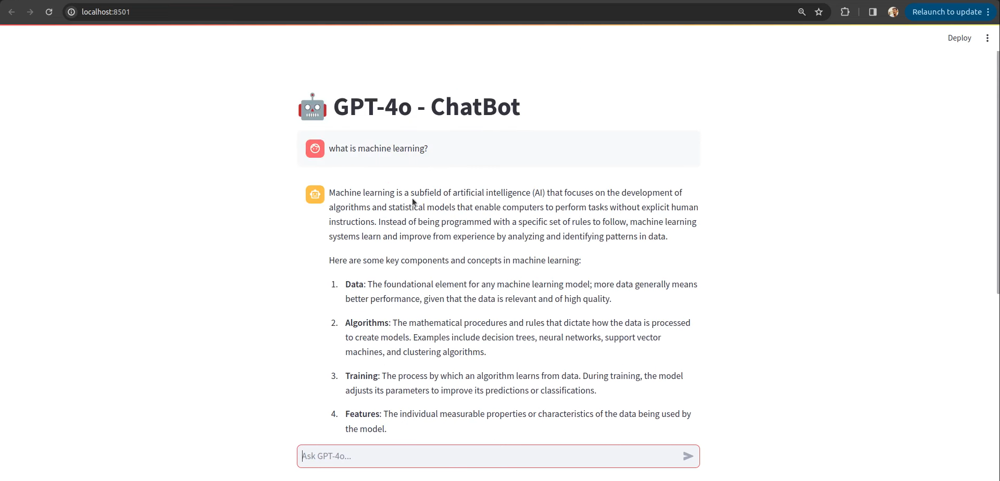

# 🤖 Chatbot using GPT-4o 🧠💬
## 📄 Overview
Welcome to the Chatbot using GPT-4o project! 🚀 This repository features a highly intelligent chatbot built using the powerful GPT-4o API, integrated with Streamlit for a seamless user experience. With GPT-4o’s advanced language understanding, the chatbot can engage in deep, context-aware conversations across a wide range of topics. Whether you're developing AI-powered assistants, automating interactions, or experimenting with conversational AI, this project offers a flexible and dynamic solution! 🌟

## 🔑 Key Features
- GPT-4o Integration 🧠: Leverages OpenAI's GPT-4o API, known for its state-of-the-art performance in language modeling and natural conversations.
- Intuitive Web Interface 💻: Built using Streamlit, the app provides a user-friendly interface for interacting with the chatbot in real-time.
- Contextual Understanding 🔍: GPT-4o's ability to hold context makes for fluid, meaningful conversations that adapt based on user inputs.
- Customizable Responses 🎨: The chatbot’s behavior and responses can be easily fine-tuned to fit specific needs, from casual conversations to formal customer support.
- Fast, Real-Time Conversations ⚡: Enjoy quick, responsive dialogue thanks to efficient backend processing and API integration.
## 🚀 Getting Started
Follow these steps to run the chatbot locally:

1. Clone the Repository
2. Install Dependencies
Ensure you have Python installed, then install the necessary libraries:
```
pip install -r requirements.txt
```
3. Set Up GPT-4o API Key
   
   To connect with the GPT-4o API, set your API key as an environment variable. Extract your openAI API Key from openAI official's site and update it in the config.json

4. Run the Chatbot
Launch the chatbot with Streamlit:
```
streamlit run app.py
```
## 🎨 Key Components
- GPT-4o API: The backbone of the chatbot, providing advanced language generation capabilities and natural interaction.
- Streamlit Frontend: Allows for smooth deployment and interaction with the chatbot via a web interface.
- Python Backend: Handles GPT-4o API communication and manages user inputs for seamless dialogue flow.
## 📊 Use Cases
- Customer Support: Provide instant responses to customer inquiries, reducing the need for human intervention.
- Personal Assistant: Help users with tasks like scheduling, reminders, or answering general questions.
- Educational Assistance: An interactive tool for students, educators, or anyone interested in learning.
## Screenshot

